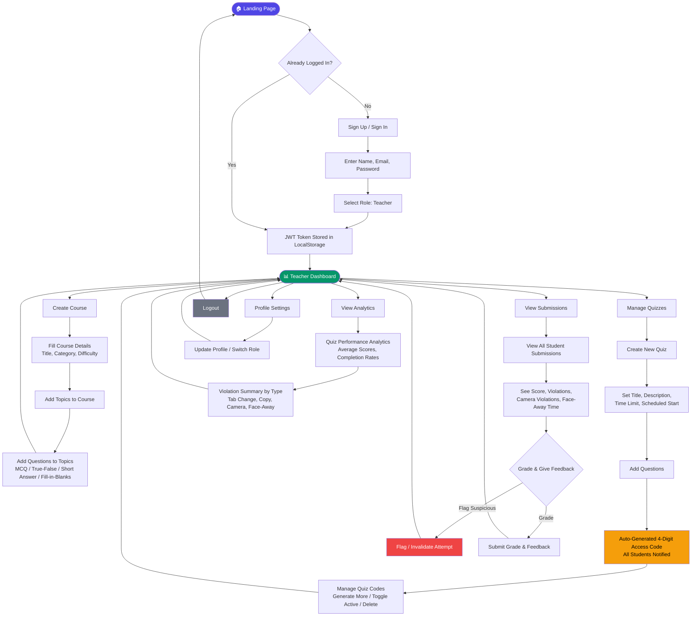
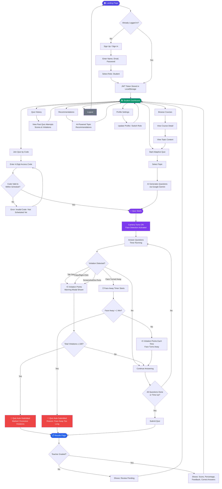
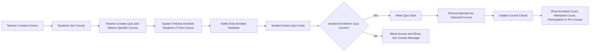

# QuizShield - System Flowcharts & Tech Stack

---

## 📋 Tech Stack

| Layer | Technology | Purpose |
|-------|-----------|---------|
| **Frontend** | React 18 + TypeScript + Vite | UI framework & build tool |
| **Styling** | Tailwind CSS + Framer Motion | Design & animations |
| **State Management** | Zustand | Global state management |
| **Backend** | Node.js + Express + TypeScript | REST API server |
| **Database** | Supabase (PostgreSQL) | Data storage & queries |
| **Authentication** | JWT + bcryptjs | Token-based authentication |
| **AI** | Google Gemini 2.0 Flash | Question generation, explanations, chatbot |
| **Email** | Resend | Notifications & transactional emails |
| **Frontend Hosting** | GitHub Pages | Static site deployment |
| **Backend Hosting** | Vercel (Serverless) | API deployment |

---

## 👨‍🏫 Teacher Flow



### Teacher Flow Summary

1. **Sign Up / Sign In** → Enter credentials, select "Teacher" role → JWT token saved
2. **Dashboard** → Central hub with access to all teacher features
3. **Create Course** → Add course details → Add topics → Add questions (MCQ, True/False, Short Answer, Fill-in-Blanks)
4. **Create Quiz** → Set title, time limit, schedule → Add questions → Auto-generated 4-digit access code → Students notified
5. **Manage Quiz Codes** → Generate additional codes, toggle active/inactive, delete codes
6. **View Submissions** → See all student attempts with scores and violation counts (including camera & face-away violations) → Grade & provide feedback → Flag/invalidate suspicious attempts
7. **View Analytics** → Quiz performance stats, violation summaries by type
8. **Profile** → Update info or switch role
9. **Logout** → Back to landing page

---

## 👨‍🎓 Student Flow



### Student Flow Summary

1. **Sign Up / Sign In** → Enter credentials, select "Student" role → JWT token saved
2. **Dashboard** → Central hub with access to all student features
3. **Browse Courses** → View course details → View topic content → Start quiz
4. **Join Quiz by Code** → Enter 4-digit access code → Validated (active code + within scheduled time) → Start quiz
5. **Adaptive Quiz** → Select topic → AI generates questions via Google Gemini → Start quiz
6. **Quiz Starts** →
   - **Camera turns ON**, face detection activated
   - Answer questions while timer runs
   - **Violation detection active:**
     - Tab switch, copy, right-click, screenshot, DevTools → +5 violation points + warning modal
     - Face turned away → face-away timer starts → +5 points each occurrence
     - Face away > 1 minute → **quiz auto-submitted**
     - Total violations ≥ 100 → **quiz auto-submitted**
7. **Results Page** → If teacher hasn't graded: "Review Pending" | If graded: Score, percentage, feedback, correct answers
8. **Quiz History** → View all past attempts with scores and violations
9. **Recommendations** → AI-powered topic suggestions based on performance
10. **Profile** → Update info or switch role
11. **Logout** → Back to landing page

---

## 🎥 Camera Proctoring Feature (New)

| Aspect | Detail |
|--------|--------|
| **Activation** | Camera turns ON when quiz starts |
| **Technology** | Browser WebCam API + Face Detection |
| **Face Monitoring** | Continuously tracks if student face is visible and facing the camera |
| **Each Face Turn-Away** | +5 violation points added |
| **Face Away > 1 Minute** | Quiz is auto-submitted immediately |
| **Recorded Data** | All camera violations are logged with timestamps |
| **Teacher Visibility** | Teacher sees camera violation count in submissions & analytics |

---

## 🔒 All Violation Types

| # | Violation Type | Detection Method | Points |
|---|---------------|-----------------|--------|
| 1 | Tab Switch | Visibility API (`visibilitychange`) | +5 |
| 2 | Copy Attempt | `copy` event blocked | +5 |
| 3 | Right Click | `contextmenu` event blocked | +5 |
| 4 | Screenshot | `PrintScreen` key detection | +5 |
| 5 | Keyboard Shortcut | Ctrl+C/A/S/I, Ctrl+Shift+I blocked | +5 |
| 6 | **Face Turned Away** | **Camera + Face Detection (NEW)** | **+5** |
| - | **Auto-Submit Trigger** | **Face away > 1 min OR violations ≥ 100** | **—** |

---

## 🔧 Technical Implementation Details

### 1. Tab Switch Detection — How It Works

```
┌─────────────────────────────────────────────────────────────────┐
│                    PAGE VISIBILITY API                          │
├─────────────────────────────────────────────────────────────────┤
│  Browser exposes: document.visibilityState                      │
│  Values: "visible" | "hidden"                                   │
│                                                                 │
│  Events fired on:                                               │
│  • Switch to another tab         → hidden                       │
│  • Minimize browser              → hidden                       │
│  • Open another app (Alt+Tab)    → hidden                       │
│  • Lock screen                   → hidden                       │
│  • Come back to quiz tab         → visible                      │
└─────────────────────────────────────────────────────────────────┘
```

**Code Logic (Pseudocode):**
```javascript
// Listen to visibility changes
document.addEventListener('visibilitychange', () => {
  if (document.hidden) {
    // User left the quiz tab!
    violationCount += 5;
    reportViolation('tab_change');
    showWarningModal('You switched tabs! +5 violation points');
    
    if (violationCount >= 100) {
      autoSubmitQuiz('excessive_violations');
    }
  }
});

// Additional: window blur/focus for edge cases
window.addEventListener('blur', () => {
  // Window lost focus (even without tab change)
  // Can be used as secondary detection
});
```

**Why Browser Knows:**
- Browser is the host — it controls all tabs
- When tab loses focus, browser fires `visibilitychange` event
- JavaScript running in that tab receives the event
- Cannot be bypassed by user (built into browser engine)

---

### 2. Camera Face Detection — How It Works

```
┌─────────────────────────────────────────────────────────────────┐
│                FACE DETECTION PIPELINE                          │
├─────────────────────────────────────────────────────────────────┤
│                                                                 │
│  ┌──────────┐    ┌──────────────┐    ┌─────────────────┐       │
│  │  WebCam  │───▶│ Video Stream │───▶│ Canvas/Frame    │       │
│  │  (User)  │    │ getUserMedia │    │ Capture         │       │
│  └──────────┘    └──────────────┘    └────────┬────────┘       │
│                                               │                 │
│                                               ▼                 │
│                                    ┌─────────────────────┐     │
│                                    │  Face Detection     │     │
│                                    │  Model (ML)         │     │
│                                    │  • face-api.js      │     │
│                                    │  • TensorFlow.js    │     │
│                                    │  • MediaPipe Face   │     │
│                                    └─────────┬───────────┘     │
│                                               │                 │
│                                               ▼                 │
│                                    ┌─────────────────────┐     │
│                                    │  Detection Result   │     │
│                                    │  • Face found: Y/N  │     │
│                                    │  • Face box (x,y,w,h)│    │
│                                    │  • Landmarks (68pts)│     │
│                                    │  • Head pose angles │     │
│                                    └─────────────────────┘     │
│                                                                 │
└─────────────────────────────────────────────────────────────────┘
```

**Step-by-Step Process:**

| Step | What Happens | Technical Detail |
|------|-------------|------------------|
| 1 | Request camera | `navigator.mediaDevices.getUserMedia({ video: true })` |
| 2 | Attach to video element | `videoElement.srcObject = stream` |
| 3 | Capture frames | Every 200-500ms, draw video to hidden canvas |
| 4 | Run face detection | Pass canvas image to ML model |
| 5 | Analyze results | Check if face detected, get head pose |
| 6 | Determine "looking away" | Face missing OR head rotated > 30° |
| 7 | Update violation state | Start/stop timers, add points |

---

### 3. Face Away Detection — State Machine

```
                    ┌─────────────────┐
                    │                 │
          ┌────────▶│    LOOKING      │◀────────┐
          │         │   (Normal)      │         │
          │         └────────┬────────┘         │
          │                  │                  │
          │         Face turns away             │
          │         or not detected             │
          │                  │                  │
          │                  ▼                  │
          │         ┌─────────────────┐         │
          │         │                 │         │
  Face    │         │  LOOKING AWAY   │         │ Face returns
  returns │         │  (Timer active) │         │ within 60s
  after   │         └────────┬────────┘         │
  60s+    │                  │                  │
  (rare)  │         Timer reaches               │
          │         60 seconds                  │
          │                  │                  │
          │                  ▼                  │
          │         ┌─────────────────┐         │
          │         │                 │         │
          └─────────│  AUTO-SUBMIT    │─────────┘
                    │  (Quiz ended)   │
                    └─────────────────┘
```

**Violation Point Logic:**
```javascript
// State variables
let isLookingAway = false;
let awayStartTime = null;
let awayEventCount = 0;  // Each "turn away" event

function onFaceDetectionResult(result) {
  const facePresent = result.faceDetected;
  const facingCamera = result.headPose.yaw < 30 && result.headPose.pitch < 25;
  const isLooking = facePresent && facingCamera;

  if (!isLooking && !isLookingAway) {
    // Just started looking away
    isLookingAway = true;
    awayStartTime = Date.now();
    awayEventCount++;
    
    // Add +5 violation points for this "away event"
    violationCount += 5;
    reportViolation('face_turned_away', { eventNumber: awayEventCount });
    
  } else if (!isLooking && isLookingAway) {
    // Still looking away — check duration
    const awayDuration = Date.now() - awayStartTime;
    
    if (awayDuration >= 60000) { // 60 seconds = 1 minute
      autoSubmitQuiz('face_away_too_long');
    }
    
  } else if (isLooking && isLookingAway) {
    // Face returned — reset timer
    isLookingAway = false;
    awayStartTime = null;
    // Points already added, timer just resets
  }
}

// Run detection every 300ms
setInterval(() => {
  const frame = captureVideoFrame();
  const result = faceDetectionModel.detect(frame);
  onFaceDetectionResult(result);
}, 300);
```

---

### 4. Head Pose Estimation — How System Knows You're Not Looking

```
                FACE LANDMARKS (68 points)
                
                    Forehead
                       ●
                      / \
              ●──────●───●──────●
             /    (eyebrows)    \
            ●                    ●
           /  ●    Eyes    ●      \
          ●    ●──●   ●──●    ●    ●
               (pupils)
                    ●
                   Nose
                    ●
              ●─────●─────●
                  Mouth
                    ●
                   Chin
```

**Head Pose Angles:**

| Angle | Movement | "Looking Away" Threshold |
|-------|----------|-------------------------|
| **Yaw** | Left ↔ Right | > 30° either direction |
| **Pitch** | Up ↔ Down | > 25° either direction |
| **Roll** | Tilt head | > 20° (optional) |

**Calculation Method:**
1. Detect 68 facial landmarks
2. Use nose tip, chin, eye corners as reference points
3. Apply PnP (Perspective-n-Point) algorithm
4. Calculate 3D rotation angles from 2D points
5. Compare angles against thresholds

---

### 5. Complete Detection Flow Diagram

```
┌─────────────────────────────────────────────────────────────────────┐
│                     QUIZ STARTS                                     │
│                         │                                           │
│            ┌────────────┴────────────┐                              │
│            ▼                         ▼                              │
│   ┌─────────────────┐      ┌─────────────────┐                     │
│   │ Tab Detection   │      │ Camera Detection│                     │
│   │ (Visibility API)│      │ (Face Detection)│                     │
│   └────────┬────────┘      └────────┬────────┘                     │
│            │                        │                               │
│            │  Every event           │  Every 300ms                  │
│            ▼                        ▼                               │
│   ┌─────────────────┐      ┌─────────────────┐                     │
│   │ Tab hidden?     │      │ Face detected?  │                     │
│   │ YES → +5 points │      │ No → Away event │                     │
│   │ Show warning    │      │ Yes → Check pose│                     │
│   └────────┬────────┘      └────────┬────────┘                     │
│            │                        │                               │
│            │                        ▼                               │
│            │               ┌─────────────────┐                     │
│            │               │ Head pose OK?   │                     │
│            │               │ Yaw<30° Pitch<25│                     │
│            │               │ No → +5 points  │                     │
│            │               │ Start 60s timer │                     │
│            │               └────────┬────────┘                     │
│            │                        │                               │
│            ▼                        ▼                               │
│   ┌─────────────────────────────────────────┐                      │
│   │         VIOLATION AGGREGATOR            │                      │
│   │  Total points from all sources          │                      │
│   │  If total >= 100 → AUTO SUBMIT          │                      │
│   │  If face away > 60s → AUTO SUBMIT       │                      │
│   └─────────────────────────────────────────┘                      │
│                         │                                           │
│                         ▼                                           │
│              ┌─────────────────┐                                   │
│              │ Report to Server│                                   │
│              │ POST /violations│                                   │
│              └─────────────────┘                                   │
│                                                                     │
└─────────────────────────────────────────────────────────────────────┘
```

---

### 6. Libraries You Can Use (For Implementation)

| Library | Purpose | Size | Accuracy |
|---------|---------|------|----------|
| **face-api.js** | Face detection + landmarks + pose | ~6MB models | High |
| **TensorFlow.js + BlazeFace** | Lightweight face detection | ~400KB | Medium |
| **MediaPipe Face Mesh** | 468 landmarks + pose | ~2MB | Very High |
| **tracking.js** | Simple face detection | ~100KB | Low |

**Recommended for QuizShield:** `face-api.js` — good balance of accuracy and ease of use.

---

### 7. False Positive Prevention

| Issue | Solution |
|-------|----------|
| Brief glance away (< 2 sec) | Add 2-second grace period before counting as "away" |
| Poor lighting | Calibration step before quiz + lower confidence threshold |
| Webcam lag | Use smoothing (average last 3-5 frames) |
| Multiple faces | Only track largest/closest face |
| Face partially visible | Require minimum detection confidence (e.g., > 0.7) |

**Smoothing Example:**
```javascript
const recentResults = []; // Last 5 detection results

function smoothedIsLooking(currentResult) {
  recentResults.push(currentResult.isLooking);
  if (recentResults.length > 5) recentResults.shift();
  
  // Require 3+ out of 5 frames to be "away" before triggering
  const awayCount = recentResults.filter(r => !r).length;
  return awayCount < 3; // Looking = true if less than 3 away frames
}
```

---

## 📈 Course-Specific Quiz Flow (Straight Chart)



### Straight Flow Summary

1. Teacher creates a course.
2. Students join that course.
3. Teacher creates a quiz and links it to that specific course.
4. System sends notifications only to students enrolled in that course.
5. If a non-enrolled student tries with quiz code, system blocks access.
6. Enrolled students can start quiz.
7. Analytics update by course showing:
   - Total enrolled students
   - Students who attempted quizzes
   - Participation percentage

---

*Generated for QuizShield Project*
