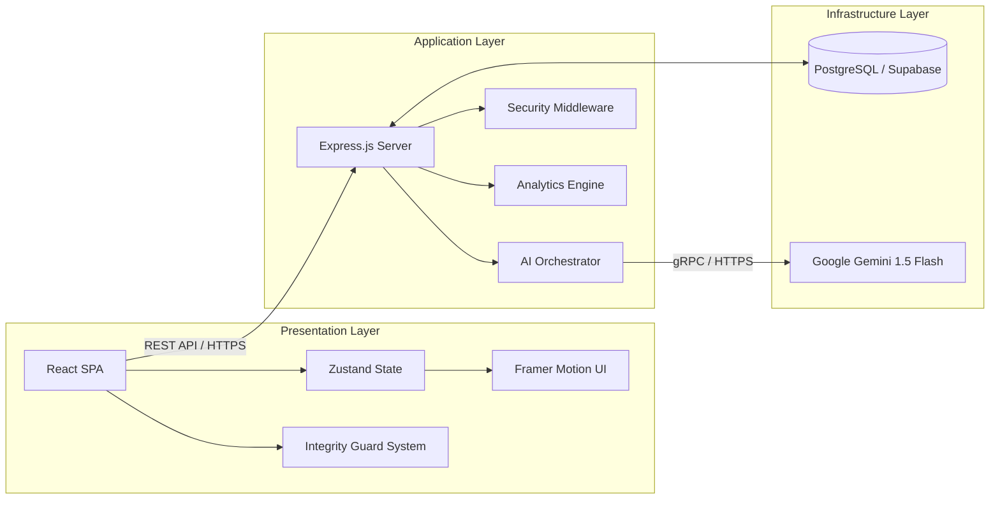

# QuizShield | Enterprise Adaptive Learning & Integrity System

QuizShield is a comprehensive, AI-integrated educational platform engineered for secure asynchronous assessments and personalized learning paths. It bridges the gap between flexible online learning and stringent academic integrity.

---

## � System Architecture & Design

The platform implements a decoupled **Service-Oriented Architecture (SOA)**, ensuring high availability and separation of concerns between the presentation layer, business logic, and data persistence.

### High-Level Component Overview



### Design Patterns Applied:
*   **Provider Pattern**: Used throughout the React frontend for context and layout management.
*   **Repository Pattern**: Data access logic is abstracted within backend services (e.g., `quizService`, `authService`).
*   **Middleware Pattern**: Robust request pipeline for authentication, logging (Morgan), and error handling.
*   **AI-Agents**: Utilizing Gemini 1.5 Flash for non-deterministic content generation (Adaptive Questioning).

---

## 💻 Tech Stack

| Layer | Technology | Rationale |
| :--- | :--- | :--- |
| **Frontend** | React 18 / TypeScript | Type-safe component architecture. |
| **Build Tool** | Vite | Ultra-fast HMR and optimized production bundling. |
| **Styling** | Tailwind CSS | Utility-first design system for consistent UI/UX. |
| **State** | Zustand | Lightweight, scalable state management without Redux boilerplate. |
| **AI Engine** | Gemini 2.5 Flash | Low-latency, high-reasoning LLM for real-time question generation. |
| **Backend** | Node.js / Express / TS | Unified language stack with high I/O throughput. |
| **Database** | Supabase (PostgreSQL) | Modern relational DB with Row Level Security (RLS). |

---

## 📂 Project Structure

A clean, predictable directory structure facilitates rapid onboarding and modular maintenance.

```text
QuizShield/
├── frontend/               # React Application
│   ├── src/
│   │   ├── components/     # Atomic UI components & Layouts
│   │   ├── hooks/          # Reusable business logic
│   │   ├── pages/          # View components / Route entry points
│   │   ├── store/          # Zustand state definitions
│   │   └── types/          # Global TypeScript interfaces
├── backend/                # Node.js Express API
│   ├── src/
│   │   ├── config/         # Environment & DB configurations
│   │   ├── controllers/    # Request handlers
│   │   ├── middleware/     # Auth & Error guards
│   │   ├── routes/         # API endpoint definitions
│   │   └── services/       # Core business logic & AI integration
└── .github/                # CI/CD Workflows
```

---

## 🛡 Security & Integrity Features

The "Shield" in QuizShield refers to a multi-layered security approach:

1.  **Client-Side Integrity Guard**:
    *   **Event Interception**: Monitoring `visibilitychange`, `blur`, and `focus` to detect tab switching.
    *   **Input Protection**: Global event listeners to prevent `contextmenu` (Right Click), `copy`, and sensitive keyboard shortcuts.
2.  **Server-Side Validation**:
    *   **JWT Authentication**: Secure stateless session management.
    *   **Audit Logging**: Every assessment violation is captured with a high-fidelity timestamp and severity rating.
3.  **Data Isolation**: Using Supabase RLS to ensure students can only access their own attempt data while teachers have scoped access to their courses.

### Face Detection Proctoring (Implemented)

QuizShield includes real-time browser-side face detection proctoring during quiz attempts:

1. **Pre-Quiz Camera Gate**:
    * When a student clicks **Start Quiz**, a camera-permission modal opens before entering the quiz.
    * The student must grant camera permission and see a live preview to proceed.
2. **Live Monitoring During Quiz**:
    * Face status is tracked as `looking`, `away`, or `no_face`.
    * A visible camera panel shows monitoring state, away timer, and violation count.
3. **Violation Logic**:
    * Head-pose thresholds detect face-away events.
    * Grace period + smoothing reduce false positives.
    * Looking away for too long triggers auto-submit.
4. **Privacy & Architecture**:
    * Detection runs fully in-browser using `face-api.js` (TinyFaceDetector + 68 landmarks).
    * No raw camera stream is uploaded to the backend for detection.

### GitHub Pages Deployment Note (Important)

Face model files are served from `frontend/public/models` and loaded with Vite `BASE_URL`.

This prevents 404 errors on repo-based GitHub Pages URLs (e.g. `/QuizShield/models/...`) where absolute root `/models/...` would fail.

---

## � Development Workflow

### Prerequisites
*   Node.js v18.x+
*   NPM v9.x+
*   Environment access (Supabase & Google AI Studio)

### 1. Repository Setup
```bash
git clone https://github.com/Waqar-743/QuizShield.git
cd QuizShield
```

### 2. Backend Initialization
```bash
cd backend
npm install
# Configure .env with SUPABASE_URL, SUPABASE_ANON_KEY, and GEMINI_API_KEY
npm run dev
```

### 3. Frontend Initialization
```bash
cd ../frontend
npm install
# Configure .env with VITE_API_URL and Supabase credentials
npm run dev
```

---

## � Roadmap & Scalability

*   **Q1 2026**: Integration of WebSocket-based real-time proctoring notifications for teachers.
*   **Q2 2026**: Transition to a Monorepo using Turborepo for shared types and linting configurations.
*   **Q3 2026**: Implementation of "Lockdown Browser" mode via Electron wrapper.

---

Designed and Engineered by the QuizShield Team.
