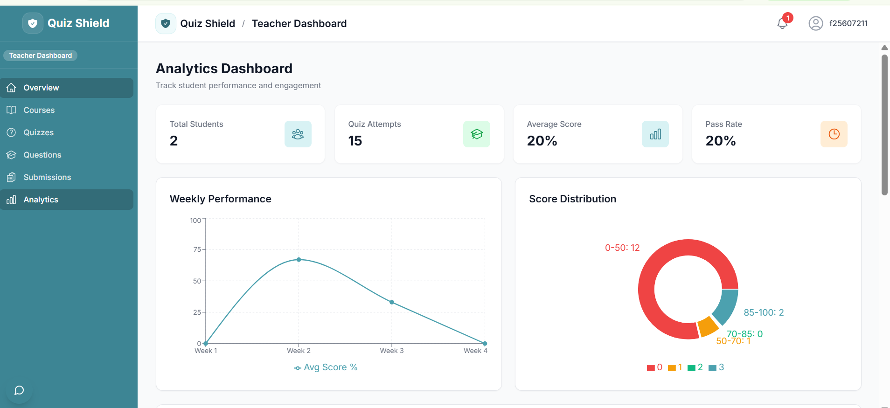
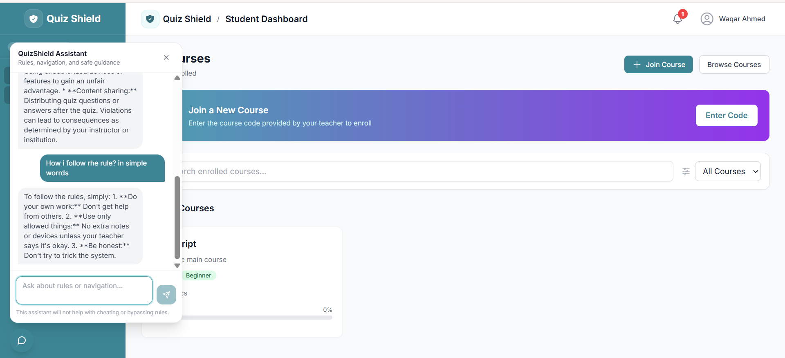
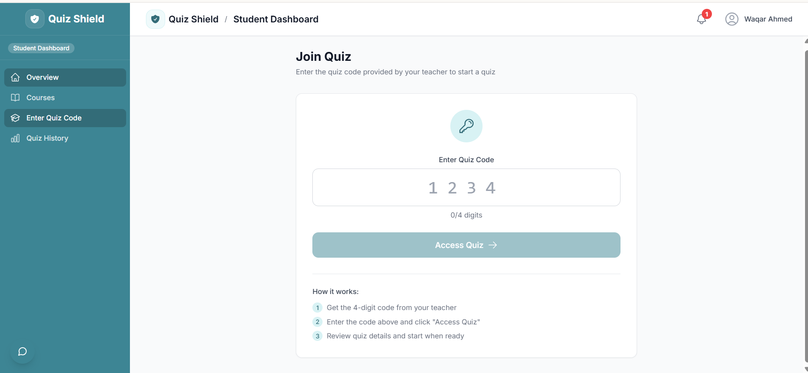
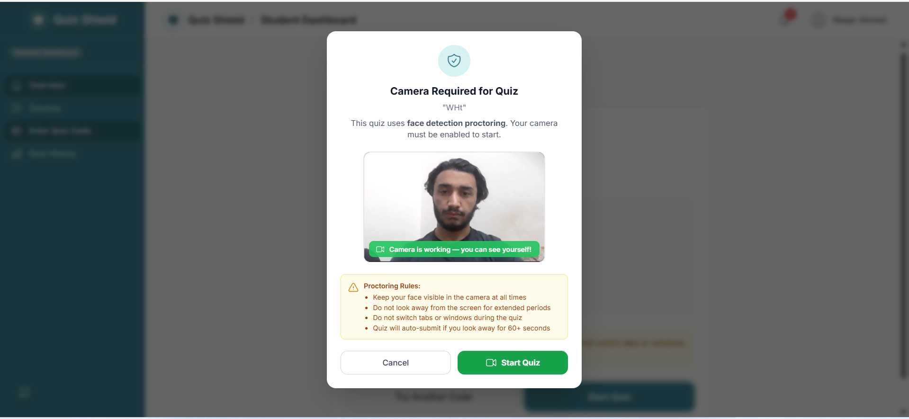

# QuizShield

QuizShield is a secure quiz and adaptive learning platform built for teachers and students. It combines role-based dashboards, quiz management, AI-assisted workflows, browser proctoring, and mandatory webcam-based student identity verification.

## Screens

<p align="center">
  <a href="./Teacher-Dashboard.png">
    
  </a>
  <a href="./Chatbot.png">
    
  </a>
</p>

<p align="center">
  <a href="./Quiz.png">
    
  </a>
  <a href="./Face-detection.png">
    
  </a>
</p>

## What the system does

- Teacher and student authentication
- Mandatory two-step student login:
  1. email/password
  2. live webcam face verification
- Teacher login without webcam verification
- Course, topic, question, and quiz management
- Quiz access by code
- In-quiz proctoring with browser activity monitoring
- Webcam-based face monitoring during quiz attempts
- Analytics and reporting for teachers
- AI-assisted learning and question generation

## Student login security flow

QuizShield now enforces a strict login gate for students:

1. Student submits email and password.
2. Backend validates credentials.
3. Backend returns a temporary face-verification token instead of a final session token.
4. Frontend switches from the login form to the webcam verification step.
5. Student captures a live frame and submits it to `/api/auth/verify-face-login`.
6. Only after successful verification is the final JWT issued and the student redirected.

If a student does not already have a saved face encoding, the first successful live verification enrolls it for future logins.

## Tech stack

### Frontend

- React 18
- TypeScript
- Vite
- Tailwind CSS
- Zustand
- React Router
- Axios
- face-api.js

### Backend

- Node.js
- Express
- TypeScript
- JWT authentication
- bcryptjs
- multer
- morgan

### Services

- Supabase (PostgreSQL)
- Google Generative AI
- Resend

## Project structure

```text
QuizShield/
├── frontend/
│   ├── public/models/          # face-api.js model files
│   └── src/
│       ├── components/
│       ├── pages/
│       ├── services/
│       ├── store/
│       └── types/
├── backend/
│   ├── migrations/
│   └── src/
│       ├── config/
│       ├── controllers/
│       ├── middleware/
│       ├── routes/
│       └── services/
└── .github/
```

## Local setup

### Prerequisites

- Node.js 18+
- npm
- Supabase project
- Google AI API key

### 1. Clone the repository

```bash
git clone <your-repo-url>
cd QuizShield
```

### 2. Backend setup

```bash
cd backend
npm install
npm run dev
```

Required backend environment variables:

```env
SUPABASE_URL=
SUPABASE_KEY=
NODE_ENV=development
PORT=5000
FRONTEND_URL=http://localhost:3000
JWT_SECRET=
RESEND_API_KEY=
GEMINI_API_KEY=
VITE_API_URL=
```

### 3. Frontend setup

```bash
cd frontend
npm install
npm run dev
```

The frontend runs on `http://localhost:3000` in the current setup.

## Database note

The `users` table must include these columns for face verification:

```sql
ALTER TABLE users ADD COLUMN IF NOT EXISTS profile_picture_url TEXT;
ALTER TABLE users ADD COLUMN IF NOT EXISTS face_encoding TEXT;
```

That migration is included in:

```text
backend/migrations/003_add_profile_picture_columns.sql
```

## Validation commands

Frontend:

```bash
npm run lint
npm run build
```

Backend:

```bash
npx tsc --noEmit
```

## Deployment overview

- Frontend: GitHub Pages / GitLab Pages
- Backend: Vercel
- Database: Supabase

Face models are loaded from `frontend/public/models` using Vite `BASE_URL`, so deployment under repository subpaths works correctly.

## Summary

QuizShield is centered on exam integrity. The most important enforcement rule in the current system is that students cannot access the dashboard with password-only login; they must complete live webcam verification first.
