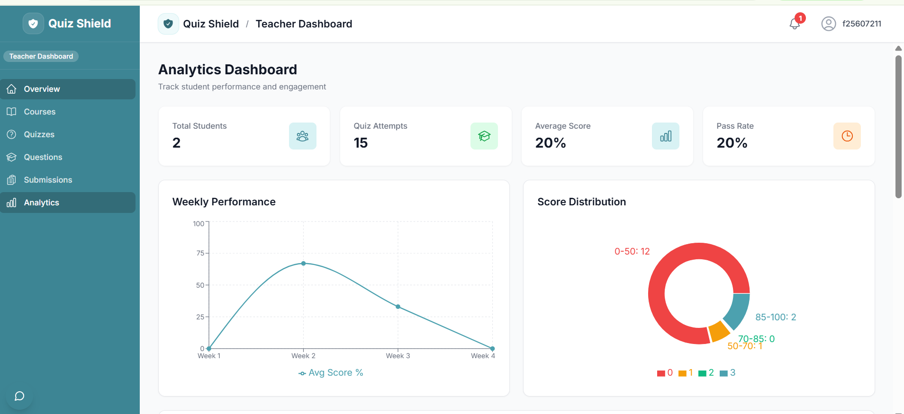
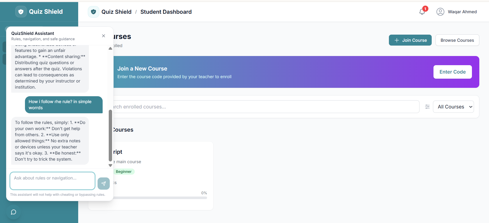
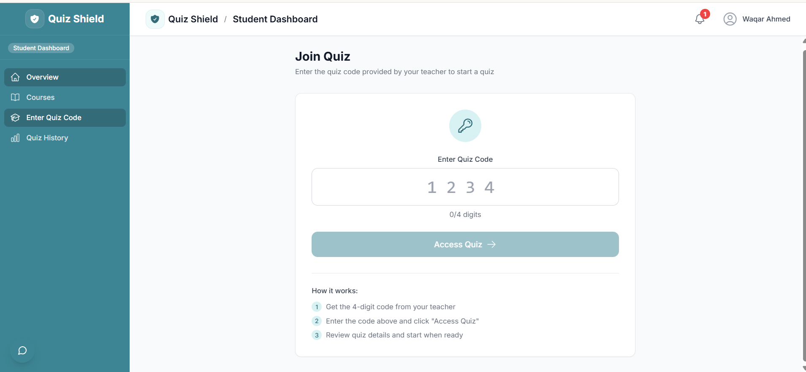
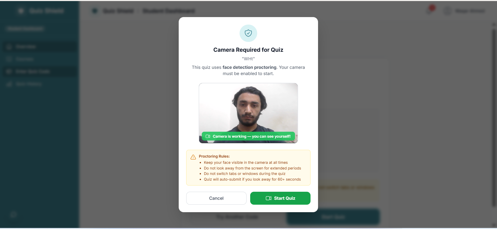

# QuizShield

> Built by **Waqar** — a final-year project that grew into a real proctoring platform.

## Why this exists

Every student remembers the same scene: a teacher pacing the aisles during an exam, eyes darting left and right, trying to be everywhere at once. Move the exam online and that pressure disappears — but so does the integrity. Webcams stay covered, tabs get switched, and "I had a connection issue" becomes the universal alibi.

QuizShield is my answer to that. It's a quiz platform where the camera isn't optional, the proctoring isn't a checkbox, and the system enforces honesty so the teacher doesn't have to.

## What it does

- **Two-step student login** — password first, then a live webcam frame matched against an enrolled face encoding. No face match, no dashboard.
- **Teachers** get courses, quizzes, AI-assisted question generation, and analytics with a clean dashboard.
- **Quiz attempts** are watched: tab switches, focus loss, and face-absence are all logged as violations and surfaced to the teacher on submission review.
- **Access codes** make joining a quiz friction-free — students don't hunt for links, they type a 4-digit code.
- **AI assistant** (Gemini) helps students study and helps teachers draft questions when inspiration runs dry.

## Screens

<p align="center">
  <a href="./Teacher-Dashboard.png"></a>
  <a href="./Chatbot.png"></a>
</p>
<p align="center">
  <a href="./Quiz.png"></a>
  <a href="./Face-detection.png"></a>
</p>

## How the student login actually works

1. Student submits email + password.
2. Backend validates and returns a **temporary** face-verification token — not a session token.
3. Frontend swaps to the webcam step and captures a live frame.
4. `POST /api/auth/verify-face-login` runs a euclidean-distance match against the stored encoding.
5. Only on a match is the real JWT issued. First-time logins enroll the face automatically.

The whole point is that step 5 is the only door into the dashboard. There's no bypass.

## Stack

**Frontend:** React 18 · TypeScript · Vite · Tailwind · Zustand · face-api.js
**Backend:** Node.js · Express · TypeScript · JWT · bcryptjs · helmet · express-rate-limit
**Services:** Supabase (Postgres) · Google Generative AI · Resend

## Project layout

```text
QuizShield/
├── frontend/   # React app + face-api.js models in /public/models
├── backend/    # Express API, Supabase client, migrations
└── .github/    # CI workflows
```

## Run locally

```bash
# backend
cd backend && npm install && npm run dev
# frontend (separate terminal)
cd frontend && npm install && npm run dev
```

Backend `.env`:

```env
SUPABASE_URL=
SUPABASE_KEY=
SUPABASE_SERVICE_KEY=
JWT_SECRET=                # must be 32+ chars
GEMINI_API_KEY=
RESEND_API_KEY=
FRONTEND_URL=http://localhost:3000
PORT=5000
NODE_ENV=development
```

Database needs the face columns (already in `backend/migrations/003_add_profile_picture_columns.sql`):

```sql
ALTER TABLE users ADD COLUMN IF NOT EXISTS profile_picture_url TEXT;
ALTER TABLE users ADD COLUMN IF NOT EXISTS face_encoding TEXT;
```

## Validate

```bash
# backend
cd backend && npx tsc --noEmit && npm test
# frontend
cd frontend && npm run lint && npm run build
```

## Deploy

- **Frontend:** GitHub Pages / GitLab Pages (Vite `BASE_URL` handles subpaths so face models load correctly)
- **Backend:** Vercel serverless
- **Database:** Supabase

## Security notes

The backend went through a senior-QA review (see [`QA_REPORT.md`](./QA_REPORT.md)) covering atomic submissions, race conditions, JWT lifetime, password hashing, helmet headers, input length caps, and follow-ups for institute-grade rollout (RLS, biometric data isolation, load testing).

## Closing

This started as a college project. It turned into the thing I wish my own teachers had during online exams — a system where the rules are enforced by the platform, not by the goodwill of the test-taker.

— Waqar
